# ARLearn: Immersive 3D Learning Platform

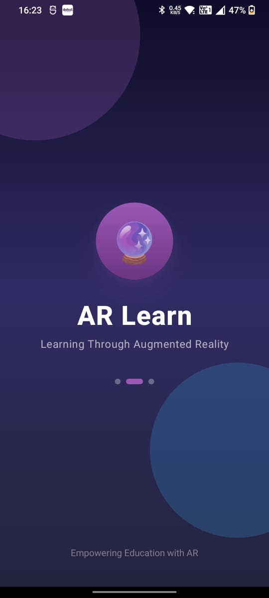

ARLearn is a robust educational platform designed to bridge the gap between traditional learning and modern technology. Using **Augmented Reality (AR)**, it allows students to visualize complex 3D models in their own environment, making education interactive, engaging, and fun.

---

## 🚀 App Walkthrough

### 🔑 Unified Authentication
The app provides a secure, role-based entry point for Students, Teachers, and Admins.

| Student Login | Teacher Login | Admin Login |
| :---: | :---: | :---: |
| 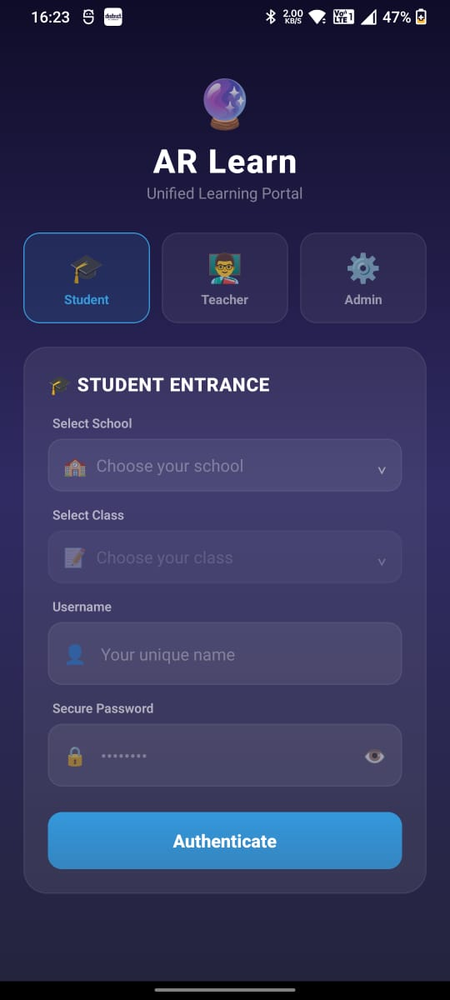 | 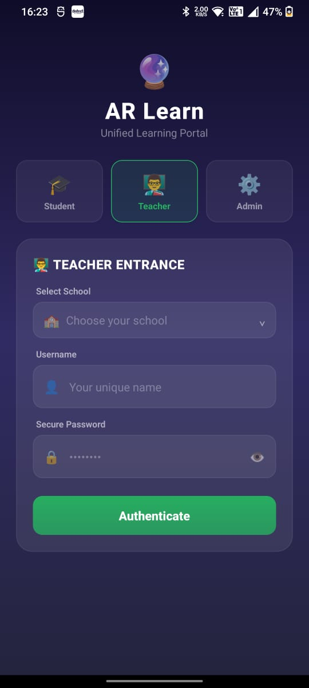 | 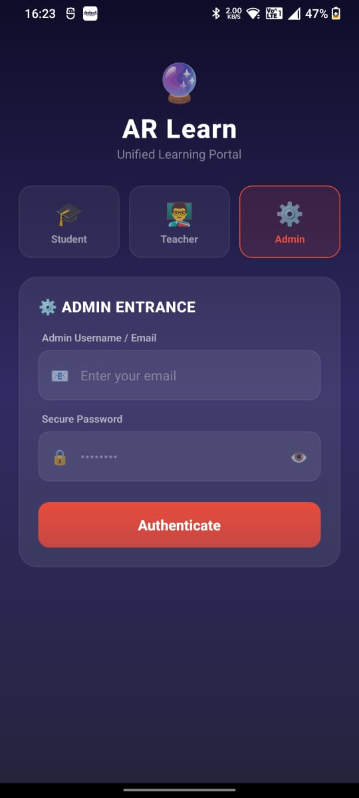 |

---

### 🎓 Student Experience
Students can browse curated educational categories and bring models to life in AR.

#### **Home & Exploration**
The home screen features featured categories like Animals, Alphabets, Numbers, and Shapes.

| Home Screen | Category View |
| :---: | :---: |
| 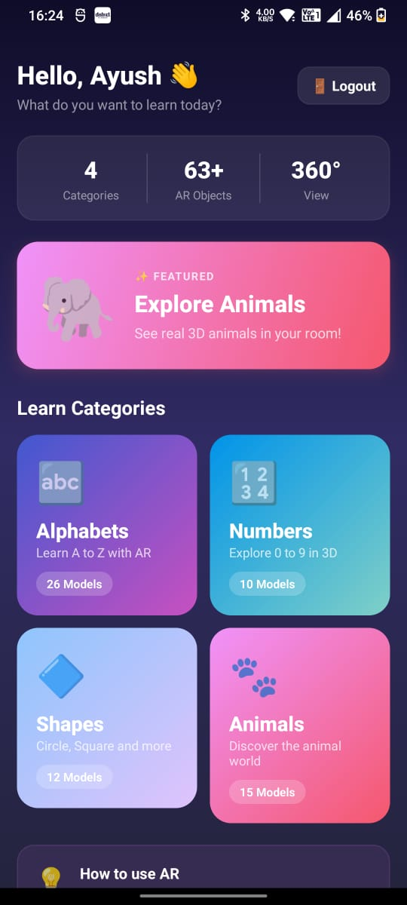 | 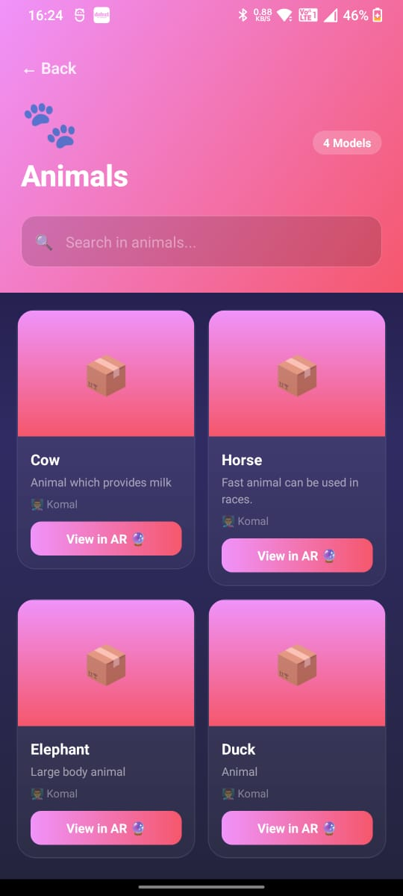 |

#### **AR Live View**
The core experience: visualize 3D models in real-time with live tracking and gesture controls.

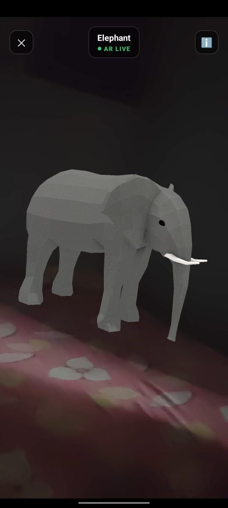

---

### 🛠️ Administration Portal
A comprehensive suite for managing schools, users, and educational content.

#### **Management Modules**
Admins can manage schools, register new institutions, and organize classes.

| Schools Management | Add New School | Classes Management |
| :---: | :---: | :---: |
| 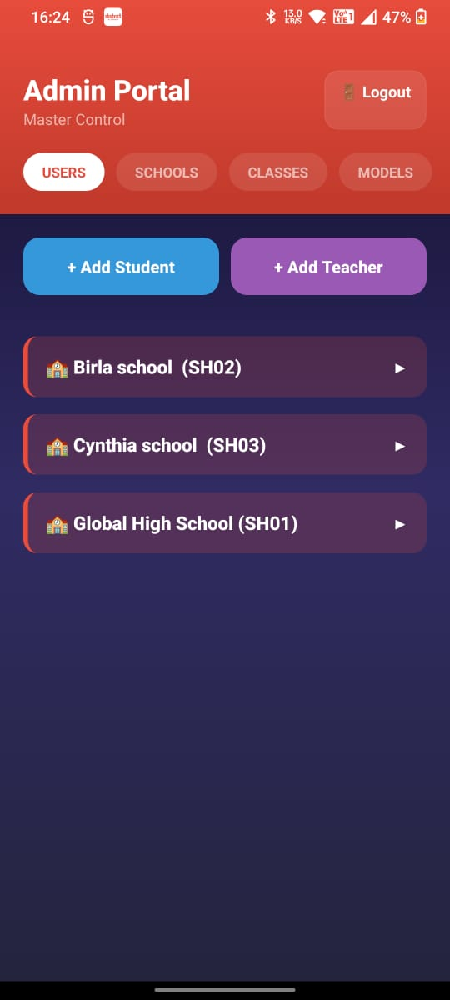 | 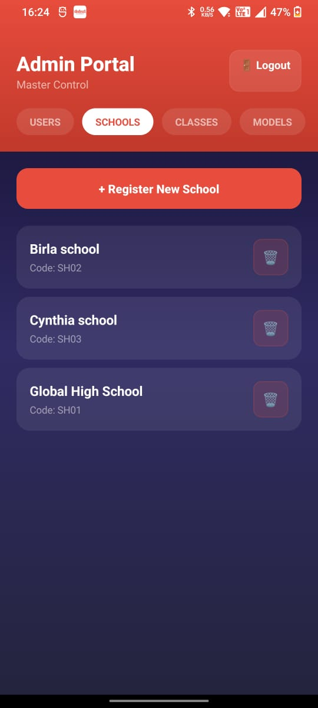 | 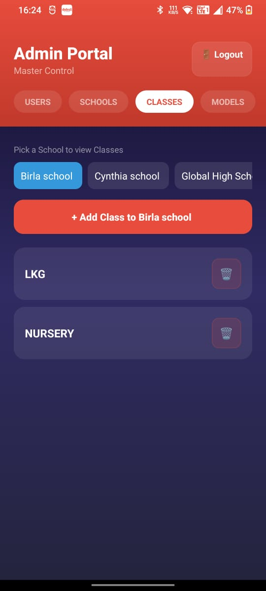 |

#### **User & Model Control**
Detailed control over teachers within schools and the global library of AR models.

| Teacher Management | AR Model Library |
| :---: | :---: |
| 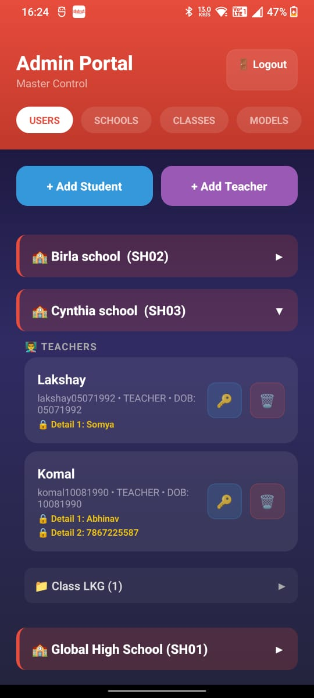 | 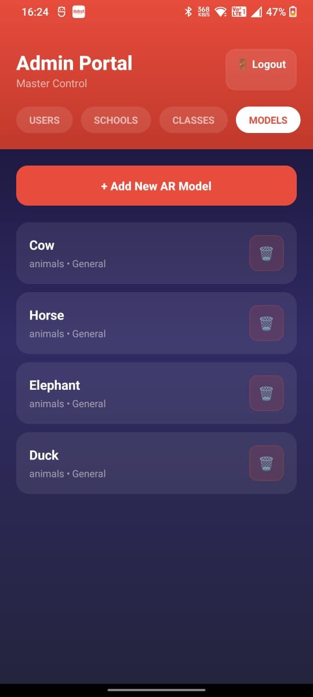 |

---

## 🛠️ Technical Overview

- **Frontend:** React Native (Cross-platform)
- **AR Engine:** Viro AR / ViroReact
- **Backend:** Supabase (PostgreSQL, Auth, Storage)
- **State Management:** React Context API
- **Navigation:** React Navigation (Stack)

---

## 💻 Installation & Setup

1. **Clone the repository**
2. **Install dependencies:**
   ```bash
   npm install
   ```
3. **Setup Environment:**
   Configure your `.env` or `src/services/supabase.ts` with your Supabase URL and Anon Key.
4. **Run the app:**
   ```bash
   # Start Metro
   npm start
   
   # Run on Android
   npm run android
   ```

---
*Empowering Education with Augmented Reality.*
